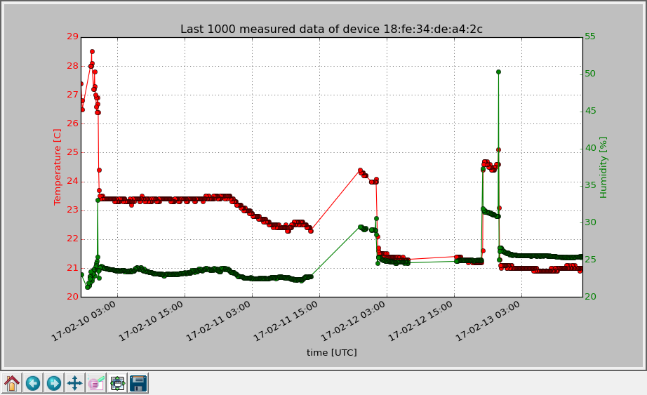
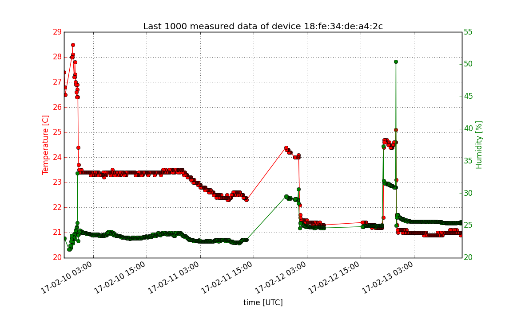
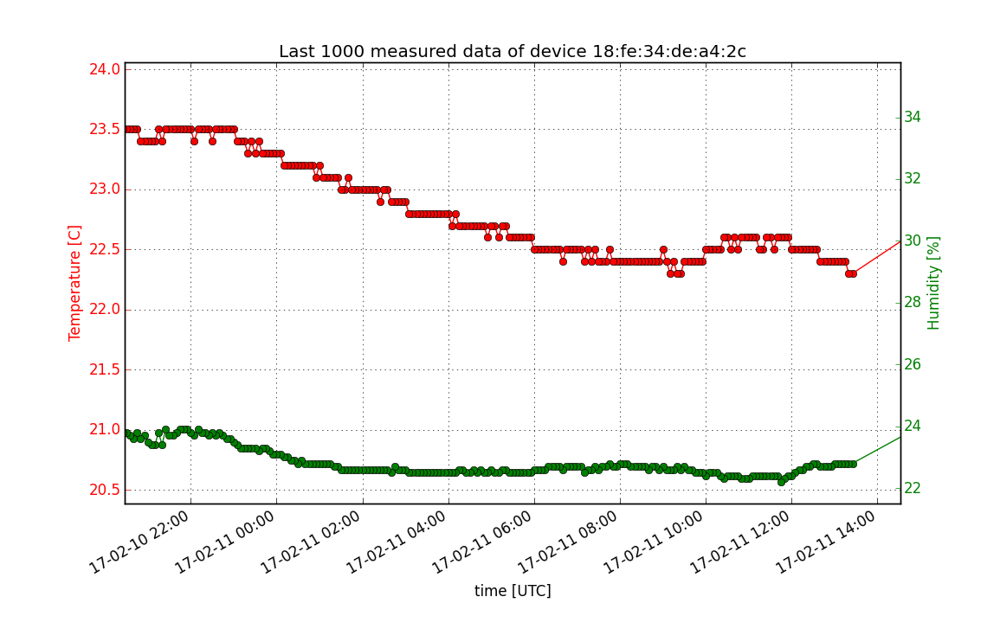

An example Python Client
========================

This is a simple client in python 3 that connects to the Terasys server,
retrieves the data and displays the temperature and humidity on the same chart.

Implementation
--------------

First, some globals
are defined: number of data, mac address of station to query and data endpoint urls.

```python
n = 1000
mac = '18:fe:34:de:a4:2c'

url_h = "https://www.terasyshub.io/api/v1/data/humidity/{}?order=desc&results={}".format(mac, n)
url_t = "https://www.terasyshub.io/api/v1/data/temperature/{}?order=desc&results={}".format(mac, n)
```

Function `get_data()` retrieves the data using `requests` library and returns array
of retrieved data. Then, we can use `pyplot` library to plot the data in an interactive
window with zoom and move options.

For customizing the plot styles, see http://matplotlib.org/

Screenshots
-----------

* window



* exported figures




